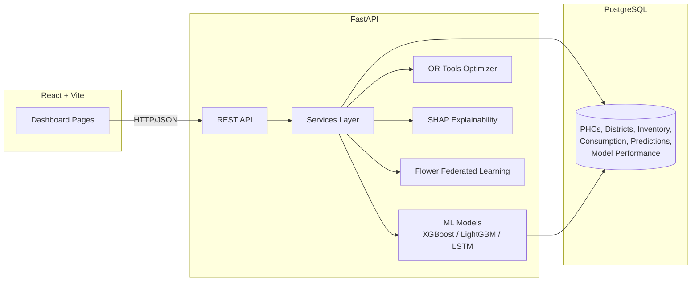
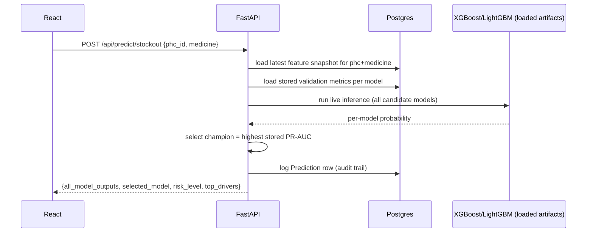
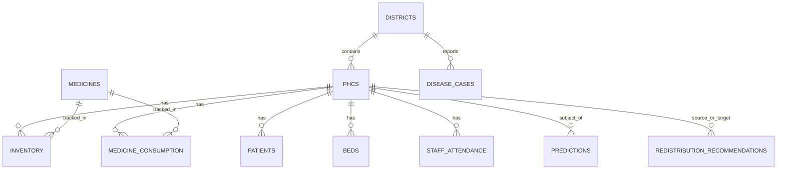

# Architecture

## System overview

## Prediction request flow

## Model training vs. inference separation

Training (`app/ml/**/train_*.py`) is run **offline**, on demand, or on a
schedule — never inside a request handler. Each training script:

1. Loads the full historical panel from Postgres.
2. Builds causal (no-leakage) features.
3. Splits by **time**, not randomly (walk-forward validation).
4. Trains baseline + XGBoost + LightGBM (+ LSTM where applicable).
5. Evaluates all candidates on the same held-out future window.
6. Persists both the trained artifact (to `models/trained/`) and the
   evaluation metrics (to the `model_performance` table), flagging exactly
   one row per task as `is_current_champion`.

At **request time**, the API only loads already-trained artifacts and runs
inference — it never retrains. This keeps the "Prediction" button fast while
still comparing genuinely different, independently-evaluated models.

## Database schema (key tables)

